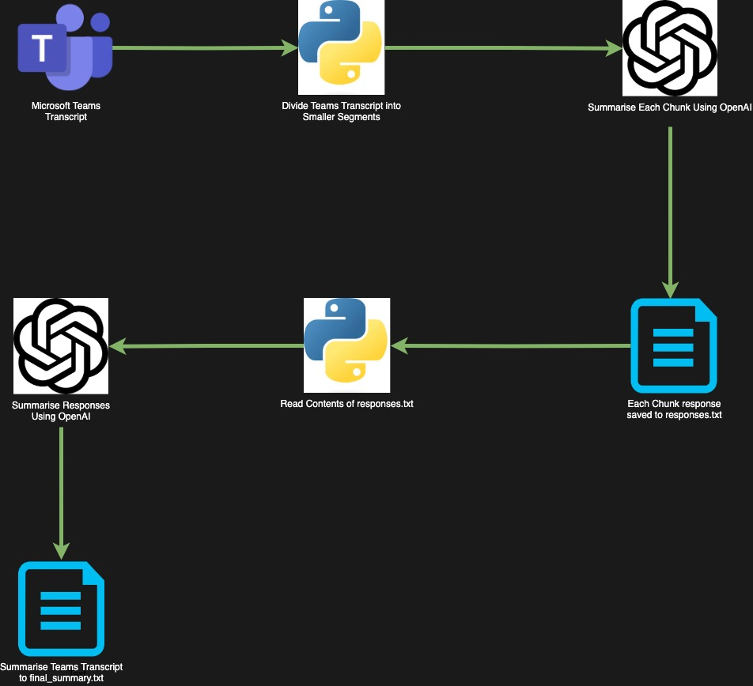

# Summarising Microsoft Teams Transcripts using Python and Azure Open AI

This Python-based tool uses Azure OpenAI to summarise Microsoft Teams meeting transcripts. It processes .docx transcript files, chunks them, and uses AI to generate comprehensive summaries.

## Diagram

The diagram below shows the current flow:


## How it works

1. Read the Teams transcript file
2. Split the document into manageable chunks
3. Use Azure OpenAI to process each chunk
4. Compile a final summary of the document

# Prerequisites

- Python 3.12
- Azure Open AI subscription
- pip (Python package installer)

# Setup

1. Clone the repository

```bash
git clone https://github.com/thomast1906/teams-transcript-summariser-python-openai.git
cd teams-transcript-summariser-python-openai
``` 

2. Create and activate a virtual environment:


### On macOS and Linux

```bash
python3 -m venv venv
source vnv/bin/activate
```

### On Windows

```bash
python -m venv venv
venv\Scripts\activate
```

3. Install dependencies:

```bash
pip install -r requirements.txt
```

4. Configure environment variables in a .env file:

```bash
FILE_PATH="<file_path>.docx"
AZURE_OPENAI_API_KEY="azure_openai_api_key"
AZURE_OPENAI_ENDPOINT="azure_openai_endpoint"
AZURE_OPENAI_DEPLOYMENT_NAME="azure_openai_deployment_name"

# prompts from prompt.json
INITIAL_PROMPT_SUMMARY="initial_prompt_summary_per_user_questions_answered"
FINAL_PROMPT_SUMMARY="final_prompt_summary_per_user_questions_answered"
```

# Usage

Run the summariser:

```bash
python summary.py
```

# Features


- Chunks large transcripts for efficient processing
- Utilises Azure OpenAI for intelligent summarisation
- Generates summaries focusing on key areas: Overview, Concerns, Current Model, Questions/Thoughts, To-Do Lists, and Outstanding Tasks
- Supports three summary types: Overall, Per User, and Per User with Questions Answered
- Logs processing steps and errors


### Prompts 

The script uses prompts to guide the AI model on what to generate. The prompts are stored in `prompt.json` and are read by the script.

1. Overall Summary
- Purpose: Generates a general summary of the entire Teams transcript
- Prompts: `initial_prompt_summary` and `final_prompt_summary`

2. User-Specific Summary
- Purpose: Creates a summary with references to each participant and their contribution timestamps
- Prompts: `initial_prompt_summary_per_user` and `final_prompt_summary_per_user`

3. Comprehensive User Summary with Q&A
- Purpose: Produces a detailed summary including user references, timestamps, and addressed questions
- Prompts: `initial_prompt_summary_per_user_questions_answered` and `final_prompt_summary_per_user_questions_answered`


Example output of each summary:
(Formatted raw .txt files for markdown)
1. [Overall Summary](summaries/1.md)
2. [User-Specific Summary](summaries/2.md)
3. [Comprehensive User Summary with Q&A](summaries/3.md)

## Logging

The script logs its progress to the console, including chunking status, API requests, and execution time.

## Error Handling

Includes error handling for file operations and AI model interactions.